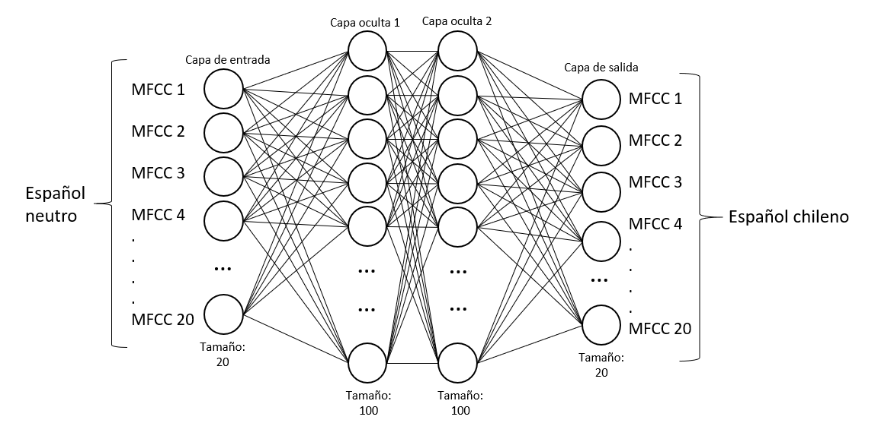

# Cambio de acento en el habla: De español neutral a chileno

Este proyecto consiste en la alteración del acento hispanohablante mediante la modificación de los Coeficientes epstrales de la Frecuencia de Mel (MFCCs). Para ello se hipotetiza que una red neuronal de tipo Feed Forward Neural Network.

 

El código consta de dos carpetas principales:

Audio_Process:
En esta carpeta se encuentran las librerías encargadas del preprocesado de los audios. 
* audioprocessor.py - Son las funciones creadas para tratar la señal y obtener las propiedades de esta.
* data manager.py - Hace uso de las funciones de audioprocessor.py para aplicarlas de manera masiva a todo slos archivos de audio. También   normaliza los datos
* data_main.py - Es un progrmaa donde se configuran los hiperparámetros necesarios y crea y guarda los arrays listos para ser introducidos a la red 

Neural_Network:
En esta carpeta se configura, entrena y testea la red.
* modelsetup.py - Aqui están las funciones encargadas de configurar la red y de crear el tensor para esta.
* modeltrainer.py - Aqui se realiza el proceso de entrenmiento de la red, y de donde se obtienen los resultados de este.

Carpeta de test:
En la carpeta de test se encuentran los códigos prescindibles del proyecto donde se han probado los modulos anteriores y donde se han probado también algoritmos y funciones especiales para corroborar que puedan funcionar en el proyecto.
* pruebas.py - Es el archivo que ha probado la parte de preprocesado de la señal
* neural_network_testing.py - Es el archivo que ha probado la configuración de la red y su entrenamiento.
